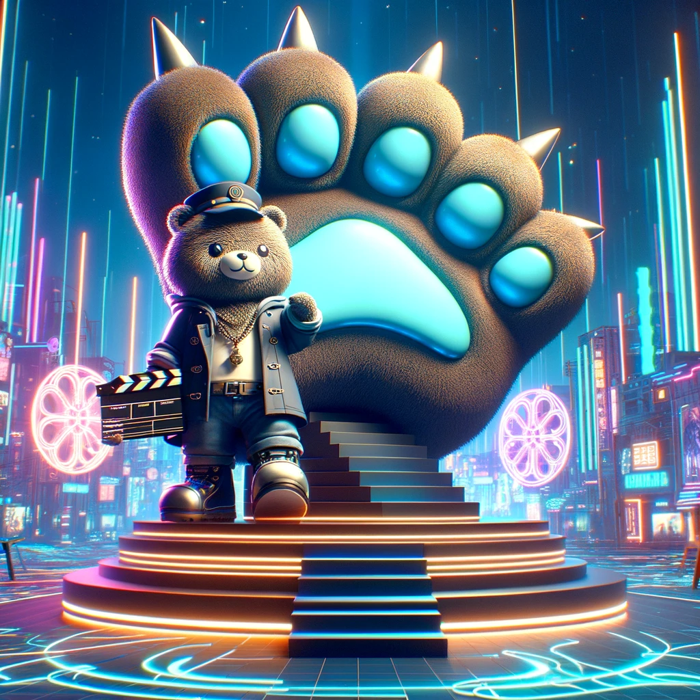



---

## SECTION 1 : PROJECT TITLE
## CinePaw AI - Explore the world of movies with your own personalised movie guide!

  

---

## SECTION 2 : EXECUTIVE SUMMARY / PAPER ABSTRACT
#### Problem Statement and Proposed Solution 

The current streaming platforms recommender systems often fail to capture individual preferences and lack personalisation elements in providing movie recommendation. This may lead to loss of users over a period of time once they feel frustrated and hop to another platform that give them better user experience to find the movies that interest them.  

Thus, our proposal - CinePaw AI introduces an advanced movie recommendation system that leverages Large Language Models (LLMs) to create an intelligent, interactive chatbot to retain the users and make them royal to our platforms. This chatbot goes beyond traditional recommendation algorithms by engaging in natural language dialogues with users, enabling a personalized movie discovery experience and improve the overall user experience in sourcing for movies that they are interested and stay royal to the platform. 

 

#### Differentiation from Existing Markets 

CinePaw AI differentiates itself from existing market offerings such as  

its recommender model (ComiRec), which provides nuanced recommendations by categorising user interests into multiple segments.  

chatbot that remembers and reference past user interactions. This stateful interaction enhances the personalization and relevance of recommendations.  

cognitive services, allowing users to engage in human-like conversations with the system, receiving both spoken and textual responses, setting it apart from the conventional, less interactive recommendation services found in current streaming platforms. 

 

#### Market Positioning 

The streaming service market is highly competitive and continuously evolving with viewers seeking more personalized and engaging experiences. We position CinePaw AI to be the forefront in shifting towards the direction what we define as Interactive User-Centric Recommendation System (IUCRS). It fills a significant gap left by existing platforms, offering unique experience that emphasises on user interaction, engagement, and satisfaction. 

 

#### Conclusion and Future Prospects 

Moving forward, CinePaw AI plans to expand its data sources and enhance its ecosystem to maintain relevance and adapt to changing market demands. The project team is also aware of potential challenges, such as data source limitations and the need for continuous updates to the AI algorithms to handle diverse user interactions. These enhancements will be crucial for scaling operations and improving the system's accuracy and more precise user engagement. 

---

## SECTION 3 : CREDITS / PROJECT CONTRIBUTION

| Official Full Name  | Student ID | Work Items | Email  |
| :------------ |:---------------:| :-----| :-----|
| Tan Eng Hui | A0291201W | Ideation, Architecture/Design, Testing, Front/Backend Development, Landscape Exploration, Knowledge Sharing, Project Documentation| e1330340@u.nus.edu |
| Lois Chee Li Ping | A0292098R | Ideation, Architecture/Design, Testing, Front/Backend Development, Landscape Exploration, Knowledge Sharing, Project Documentation| e1338192@u.nus.edu |
| Dong Yuantong | A0292041N |Ideation, Architecture/Design, Testing, Front/Backend Development, Landscape Exploration, Knowledge Sharing, Project Documentation| e1337515@u.nus.edu |
| Wang Tao | A0291189R | Ideation, Architecture/Design, Testing, Front/Backend Development, Landscape Exploration, Knowledge Sharing, Project Documentation| e1330328@u.nus.edu |

---

## SECTION 4 : VIDEO OF USE CASE DEMO AND TECHNICAL DESIGN 

| Click here for Promo video  | Click here for Tech video | 
| :------------ |:---------------:| 
|  |  | 

---

## SECTION 5 : DEPLOYMENT AND USER GUIDE

Refer to **Installation Guide** and **User Guide** respectively at appendix section in the project report at Github Folder: **ProjectReport**

---
